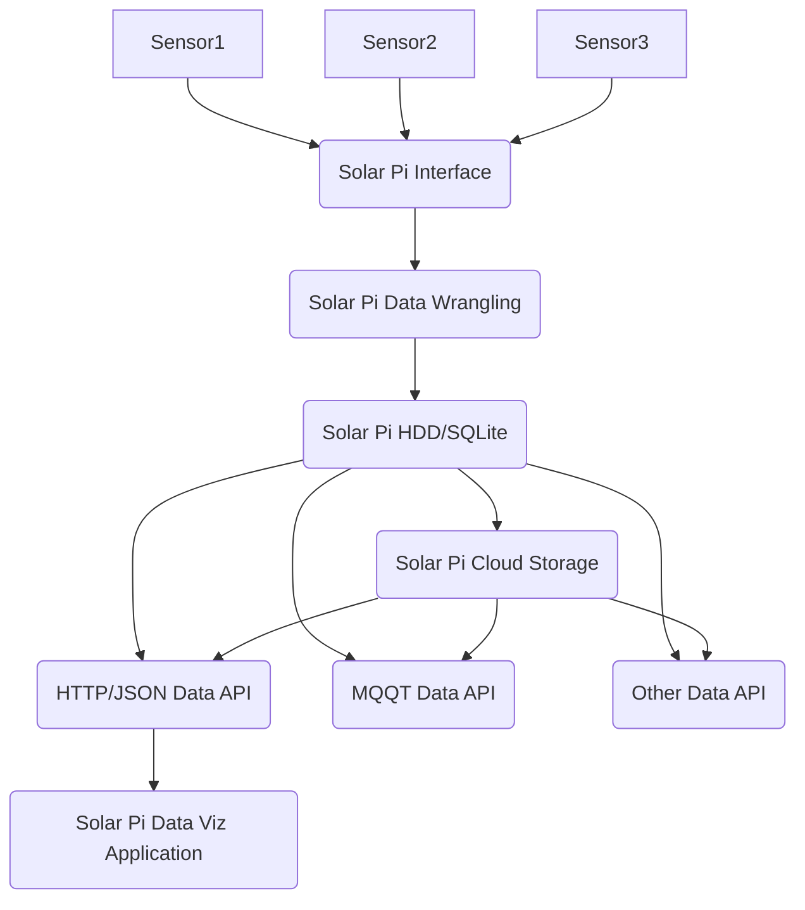

<!-- PROJECT SHIELDS -->
<!--
*** I'm using markdown "reference style" links for readability.
*** Reference links are enclosed in brackets [ ] instead of parentheses ( ).
*** See the bottom of this document for the declaration of the reference variables
*** for contributors-url, forks-url, etc. This is an optional, concise syntax you may use.
*** https://www.markdownguide.org/basic-syntax/#reference-style-links
-->
[![Contributors][contributors-shield]][contributors-url]
[![Forks][forks-shield]][forks-url]
[![Stargazers][stars-shield]][stars-url]
[![Issues][issues-shield]][issues-url]
[![MIT License][license-shield]][license-url]
[![LinkedIn][linkedin-shield]][linkedin-url]

<!-- PROJECT LOGO -->
 

  

<h3 align="center">Solar Pi</h3>

  

    Monitor Your Solar Power Equipment using a Raspberry Pi + other sensors.
     
    <a href="https://github.com/ericdmoore/solar-pi"><strong>Explore the docs »</strong></a>
     
     
    <a href="https://github.com/ericdmoore/solar-pi">View Demo</a> |
    <a href="https://github.com/ericdmoore/solar-pi/issues">Report Bug</a> |
    <a href="https://github.com/ericdmoore/solar-pi/issues">Request Feature</a>
  

<!-- TABLE OF CONTENTS -->

  
Table of Contents

  <ol>
    <li>
      <a href="#about-the-project">About The Project</a>
      <ul>
        <li><a href="#built-with">Built With</a></li>
      </ul>
    </li>
    <li>
      <a href="#getting-started">Getting Started</a>
      <ul>
        <li><a href="#prerequisites">Prerequisites</a></li>
        <li><a href="#installation">Installation</a></li>
      </ul>
    </li>
    <li><a href="#usage">Usage</a></li>
    <li><a href="#roadmap">Roadmap</a></li>
    <li><a href="#contributing">Contributing</a></li>
    <li><a href="#license">License</a></li>
    <li><a href="#contact">Contact</a></li>
    <li><a href="#acknowledgments">Acknowledgments</a></li>
  </ol>

<!-- ABOUT THE PROJECT -->
## About The Project

[![Product Name Screen Shot][product-screenshot]](https://solarpi.link)

### What It Does:

Senses, Saves, & Shows Solar Power Time-series Metrics via a web interface

- MPPT / Battery 
  - Voltages
  - State of Charge %
  - Lifetime Charge
  - Lifetime Discharge
- Panels (Before MPPT)
  - Voltages
  - Amp
  - Power
- Load
  - instant Consumption (Watts)
  - Daily Consumption
- Environmental
  - Indoor Temp
  - Outdoor Temp
  - Irridescence Score
- Lifetime Solar Power Generated
- Total solar PV generation
- Net home consumption
- Net home generation
- Total current, voltage, power, and power factor values
- Individual current transformer readings
- Harmonics inspection through a built in snapshot/plotting mechanism.

(<a href="#top">back to top</a>)

### Built With

* []
* [Svelte](https://svelte.dev/)

(<a href="#top">back to top</a>)

<!-- GETTING STARTED -->
## Getting Started

This is an example of how you may give instructions on setting up your project locally.
To get a local copy up and running follow these simple example steps.

### Prerequisites

This is an electronics project. As such there are some hardware requirements for this project. You can buy what I bought, or whish I would have boght based on the links below (note: affiliate links).

Or perhaps you already have a setup and - just want to add the monitoring `Solar-Pi`, Great! then you just need to look at the sections starting with installing your sensors.

### Proposed Bill Of Materials
- Power Components
  - [Solar Panels](https://amzn.to/3IFrQN2) - Creates the power from the Sun but your voltage and power can be all over the place
  - [EPEVER MPPT](https://amzn.to/3AVXMLm) - Squashes the Power to levels that make your battery happy - and keep it at a healthy charge  
  - [Batteries (Recommended 2x for a 24 system)](https://amzn.to/3PzTaP8) - holds the power for later, duh
  - [Voltage Regulators](//amzn.to/3yNEipz) - Takes the noisy 24volts down to a VERY stable 12v
  - [Raspberry Pi](//amzn.to/3yJGrCt) - Hopefully you already have one - because prices seem silly right now.
  - [Low Voltage Disconnect](//amzn.to/3PqLwpS) - So that you dont run your batteries down too far
  - [DC Circuit Breakers](//amzn.to/3uRjqfY) - to isolate parts of your circuit
  - [Fusebox For Load](https://amzn.to/3Od4Y8O) - to keep things isolated, safe, and tidy
- Stuff You want to Power
  - [Lights](//amzn.to/3yNEipz) - Because if you learn one thing from Matt From [DIY Perks](//www.youtube.com/playlist?list=PLOJU8YJjFwGN0hMRewz2_u2IefV-vipsk) - it's that LED strips are incredible, and how is instantly imporved vision not at the top of your list?
  - [PhotoCell Switch](//amzn.to/3z6KE4C) - Because some stuff only runs at night, & you have better stuff to do than to flip them on/off EVERYDAY
  - [USB Sockets](//amzn.to/3RFZ6rm) - Because sometimes your phone has a low battery
  - [Water Pumps](//amzn.to/3Pt5ZKX) - Because sometimes you want to start a green house with all this stuff
  - [12v Digital Timer](//amzn.to/3aFPw7g) - Because you are not a knuckle dragger who wants to turn the pump on and off EVERYDAY for the rest of your life
  - [Fans](//amzn.to/3RQ7FQP) - Because sometimes it's hot
  - [Thermal Relays](//amzn.to/3chmFXo) - Because you don't want to turn your fans on when it get's too hot, EVERYDAY for the rest of your life
- Sensors
  - [Current Sensor](//www.sparkfun.com/products/164080)
  - [Voltage Sensor](//www.sparkfun.com/products/16408)
  - [Humidity Sensor](//www.adafruit.com/product/3721)
  - [Temperature Sensors](//www.adafruit.com/product/1782)
  - [Light Sensors](//www.adafruit.com/product/1980)
  - [UV Light Sensor](//www.adafruit.com/product/4831)
  - [Motion Sensor](//www.adafruit.com/product/189)

### Architecture Overview

#### Basic Hardware Guide

Basic(Unmonitored) Power Connections:

#### Basic Software Components

(<a href="#top">back to top</a>)

<!-- USAGE EXAMPLES -->
## Usage

Use this space to show useful examples of how a project can be used. Additional screenshots, code examples and demos work well in this space. You may also link to more resources.
_For more examples, please refer to the [Documentation](https://solarpi.link)

(<a href="#top">back to top</a>)

<!-- ROADMAP -->
## Roadmap

- Data Source for Grafana
- Prometheus Support?
- Explore Renogy Charge Controllers
- Relay Drivers for Terraced Batteries 
  - aka: Water Heating
  - Battery Interface 
    - Progress signal
    - Fill Circuit
- Amazon Alexa Integration
- Alternative Internet Connection Interfaces
  - ZMQ
  - MQTT
  - LoRa
  - Streaming JSONND

See the [open issues](https://github.com/ericdmoore/solar-pi/issues) for a full list of proposed features (and known issues).

(<a href="#top">back to top</a>)

<!-- CONTRIBUTING -->
## Contributing

Contributions are what make the open source community such an amazing place to learn, inspire, and create. Any contributions you make are **greatly appreciated**.

If you have a suggestion that would make this better, please fork the repo and create a pull request. You can also simply open an issue with the tag "enhancement".
Don't forget to give the project a star! Thanks again!

1. Fork the Project
2. Create your Feature Branch (`git checkout -b feature/AmazingFeature`)
3. Commit your Changes (`git commit -m 'Add some AmazingFeature'`)
4. Push to the Branch (`git push origin feature/AmazingFeature`)
5. Open a Pull Request

(<a href="#top">back to top</a>)

## Inspirations
- [RPI Power Meter](//github.com/David00/rpi-power-monitor)
- [Powerwall Monitor](//github.com/mihailescu2m/powerwall_monitor)
- [Solarpi](https://github.com/Tafkas/solarpi)
- [Solar Thing](https://github.com/wildmountainfarms/solarthing)
- [Solar Observatory](https://github.com/petercable/solar-observatory)
- [Solar PV Monitoring](https://github.com/lewei50/Solar-PV-Monitoring)
- [Solarshed](https://github.com/corbinbs/solarshed)
- [Olen/solar-monitor](https://github.com/Olen/solar-monitor)

<!-- LICENSE -->
## License

Distributed under the MIT License. See `LICENSE.txt` for more information.

(<a href="#top">back to top</a>)

<!-- CONTACT -->
## Contact

Eric D Moore - [@ericdmoore](https://twitter.com/ericdmoore) - eric [𝓪𝓽] mooore [𝓭𝓸𝓽] cc

Project Link: [https://github.com/ericdmoore/solar-pi][project-url]

(<a href="#top">back to top</a>)

<!-- ACKNOWLEDGMENTS -->
<!-- ## Acknowledgments -->

<!-- *  -->
<!-- *  -->
<!-- *  -->

<!-- 
(<a href="#top">back to top</a>)
 -->

<!-- MARKDOWN LINKS & IMAGES -->
<!-- https://www.markdownguide.org/basic-syntax/#reference-style-links -->
[project-url]:https://github.com/ericdmoore/solar-pi
[contributors-shield]: https://img.shields.io/github/contributors/ericdmoore/solar-pi.svg?style=for-the-badge
[contributors-url]: https://github.com/ericdmoore/solar-pi/graphs/contributors
[forks-shield]: https://img.shields.io/github/forks/ericdmoore/solar-pi.svg?style=for-the-badge
[forks-url]: https://github.com/ericdmoore/solar-pi/network/members
[stars-shield]: https://img.shields.io/github/stars/ericdmoore/solar-pi.svg?style=for-the-badge
[stars-url]: https://github.com/ericdmoore/solar-pi/stargazers
[issues-shield]: https://img.shields.io/github/issues/ericdmoore/solar-pi.svg?style=for-the-badge
[issues-url]: https://github.com/ericdmoore/solar-pi/issues
[license-shield]: https://img.shields.io/github/license/ericdmoore/solar-pi.svg?style=for-the-badge
[license-url]: https://github.com/ericdmoore/solar-pi/blob/master/LICENSE.txt
[linkedin-shield]: https://img.shields.io/badge/-LinkedIn-black.svg?style=for-the-badge&logo=linkedin&colorB=555
[linkedin-url]: https://linkedin.com/in/ericmoore

[product-screenshot]: https://i.redd.it/09q1rdtno2241.png 
<!-- The product-screen shot is still a placeholders screenshot -->
